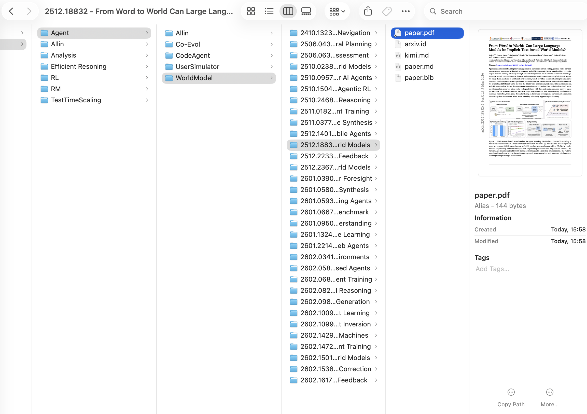
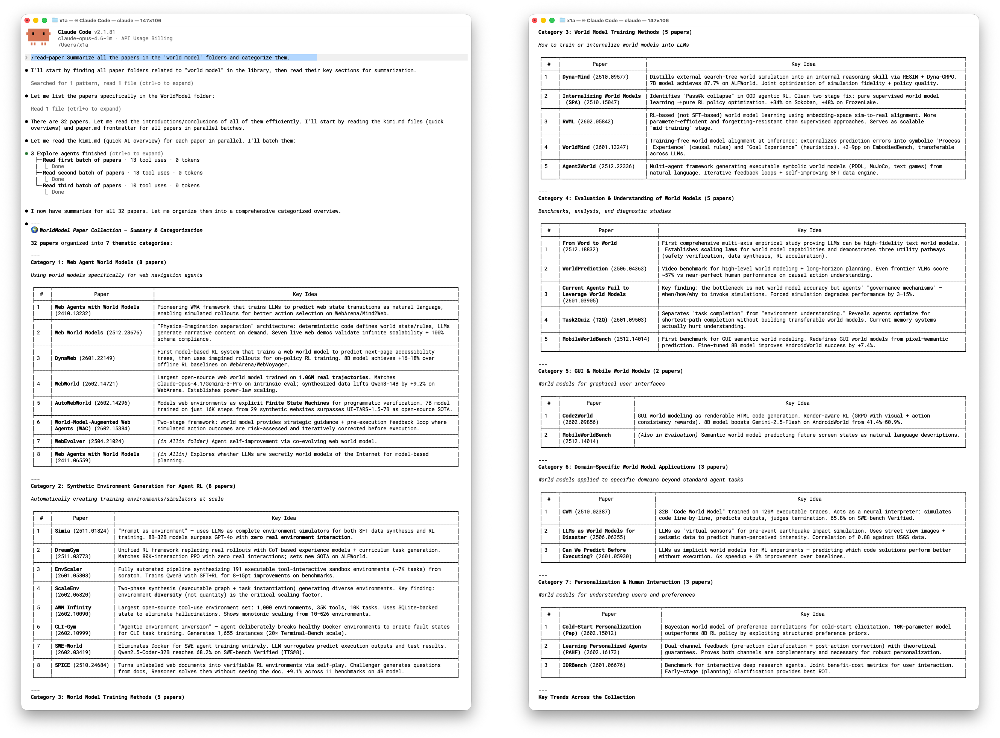

# ZoFiles

[](https://www.zotero.org)
[](https://github.com/windingwind/zotero-plugin-template)
[](LICENSE)

**Connect Claude (or other AI agents) to your Zotero library.**

ZoFiles turns your Zotero library into an agent-readable filesystem — mirroring your collection hierarchy as real directories, with per-paper folders containing Markdown, BibTeX, AI reviews, and more. Paired with a built-in [Claude Code skill](https://docs.anthropic.com/en/docs/claude-code/skills), it lets Claude read, summarize, cite, and compare your papers directly.

## Quick Start

**Requirements:** Zotero 7+ &bull; macOS / Linux (symlink mode) or Windows (copy mode) &bull; Papers with arXiv IDs

1. **Install** — Download the latest `.xpi` from [Releases](../../releases). In Zotero: **Tools > Add-ons > gear icon > Install Add-on From File**. Restart Zotero.
2. **Configure** — Go to **Zotero > Settings > ZoFiles**. Set your **Export Root** directory and choose which collections/content to export.
3. **Export** — Click **Rebuild** at the bottom of the settings panel. Your paper tree will appear in the export root.

After the initial export, ZoFiles auto-syncs — any add, modify, move, or delete in Zotero updates the export automatically.

## Features

- **Collection mirroring** — Zotero's collection tree becomes a real directory tree
- **Per-paper folders** — Each paper gets its own folder (default: `{arxivId} - {title}`)
- **Auto-sync** — Event-driven export on any library change
- **Rich content per paper:**
  - `paper.pdf` — Symlink or copy of the PDF attachment
  - `paper.md` — Full-text Markdown via [arxiv2md.org](https://arxiv2md.org)
  - `kimi.md` — AI-generated review from [papers.cool](https://papers.cool)
  - `paper.bib` — BibTeX citation from arXiv
  - `arxiv.id` — Plain text arXiv identifier
  - `notes/*.md` — Zotero notes converted to Markdown
- **Link back** — Optionally create linked attachments in Zotero pointing to exported files



> See a real exported paper folder: [`docs/example/`](docs/example/1706.03762%20-%20Attention%20Is%20All%20You%20Need/) — _Attention Is All You Need_ with PDF, Markdown, BibTeX, Kimi review, and notes.

## Exported File Structure

```
<export_root>/
├── Machine Learning/
│   ├── Transformers/
│   │   ├── 1706.03762 - Attention Is All You Need/
│   │   │   ├── paper.pdf        → symlink to Zotero storage
│   │   │   ├── paper.md         # full-text Markdown
│   │   │   ├── kimi.md          # AI review
│   │   │   ├── paper.bib        # BibTeX
│   │   │   ├── arxiv.id         # "1706.03762"
│   │   │   └── notes/
│   │   │       └── My Notes.md
│   │   └── 2311.10702 - Another Paper/
│   │       └── ...
│   └── Allin/                   # flat view: ALL papers from this + descendant collections
│       └── ...
└── Computer Vision/
    └── ...
```

## Claude Code Skills

ZoFiles ships with two [Claude Code skills](https://docs.anthropic.com/en/docs/claude-code/skills) (in `.claude/skills/`) that activate automatically when you talk to Claude about papers.



### `read-paper` — Read, Summarize & Cite

First-time setup:

```
> My ZoFiles library is at /Users/me/Papers/
> Update paper library directory structure
```

Then just ask:

```
> Read the paper 2512.18832
> Summarize the papers in Agent/WorldModel/
> Compare 2301.04104 and 2305.14078
> Give me the BibTeX for Attention Is All You Need
```

### `zotero-connector` — Import arXiv Papers

Requires Zotero running locally and Python 3.8+.

```
> Import paper 2301.07041 into Zotero
> Batch import 2301.07041 2310.06825 1706.03762
> Import 2301.07041 into my "LLM Papers" collection
```

Accepts any arXiv ID format: `2301.07041`, `2301.07041v2`, `https://arxiv.org/abs/2301.07041`, `arXiv:2301.07041`.

## Configuration

All settings are in **Zotero > Settings > ZoFiles**.

| Setting       | Description                                | Default               |
| ------------- | ------------------------------------------ | --------------------- |
| Export Root   | Directory where the paper tree is created  | _(must be set)_       |
| Folder Format | Paper folder naming template               | `{arxivId} - {title}` |
| PDF Mode      | Symlink (saves space) or Copy (standalone) | Symlink               |
| Collections   | Choose which collections to export         | All                   |
| Auto Sync     | Auto-export on library changes             | On                    |
| Link Back     | Create linked attachments in Zotero        | Off                   |
| Cache Path    | Cache for downloaded content               | `~/.cache/ZoFiles`    |

<details>
<summary><strong>Content toggles</strong></summary>

| Content        | Description                           | Default |
| -------------- | ------------------------------------- | ------- |
| PDF            | Symlink or copy of the PDF attachment | On      |
| Paper Markdown | Full-text conversion via arxiv2md.org | On      |
| Kimi Review    | AI-generated summary from papers.cool | On      |
| BibTeX         | Citation data from arXiv              | On      |
| Zotero Notes   | Your notes, converted to Markdown     | On      |
| arXiv ID file  | Plain text arXiv identifier           | On      |

</details>

<details>
<summary><strong>Folder format tokens</strong></summary>

| Token           | Example                     |
| --------------- | --------------------------- |
| `{arxivId}`     | `2311.10702`                |
| `{title}`       | `Attention Is All You Need` |
| `{firstAuthor}` | `Vaswani`                   |
| `{year}`        | `2017`                      |

</details>

<details>
<summary><strong>Rebuild modes</strong></summary>

- **Rebuild** (default) — Incremental. Only exports new/changed items and removes stale ones. Fast when most items are already exported.
- **Force Full Rebuild** — Deletes the entire export directory and re-exports everything from scratch. Use if the export gets into a broken state.

Both modes benefit from the download cache (`~/.cache/ZoFiles/`). Network content is cached on first download, so even a full rebuild is fast the second time.

</details>

## Backup Your Data

ZoFiles is **read-only** with respect to your Zotero library (unless you enable "Link back"). We still recommend **backing up your Zotero data directory before first use** — find it at **Zotero > Settings > Advanced > Files and Folders**.

> **Disclaimer:** ZoFiles is provided as-is, without warranty. The authors are not responsible for any data loss. Use at your own risk.

<details>
<summary><strong>FAQ</strong></summary>

**Q: What happens to papers without arXiv IDs?**
A: They are silently skipped. ZoFiles only exports papers with valid arXiv identifiers.

**Q: Can I use this on Windows?**
A: Yes, but set PDF mode to "Copy". Symlinks on Windows require elevated permissions.

**Q: How do I trigger a full re-export?**
A: Settings > ZoFiles > "Rebuild" (incremental) or "Force Full Rebuild" (clean start).

**Q: Does this modify my Zotero library?**
A: Only if you enable "Link back to Zotero". Otherwise, ZoFiles is read-only.

**Q: What if arxiv2md.org is down?**
A: Markdown export fails gracefully. Other content (PDF, BibTeX, notes) still exports. Cached content is unaffected.

**Q: Does the Claude Code skill work with other AI agents?**
A: The exported format is plain Markdown and BibTeX — any agent that can read files can use it. The bundled skill is designed for Claude Code, but the file structure is agent-agnostic.

</details>

<details>
<summary><strong>Development</strong></summary>

### Prerequisites

- [Node.js](https://nodejs.org/) (LTS)
- [Zotero 7](https://www.zotero.org/support/beta_builds)

### Setup

```bash
git clone https://github.com/X1AOX1A/ZoFiles.git
cd ZoFiles
npm install
cp .env.example .env    # edit with your Zotero path
```

### Dev Mode & Build

```bash
npm start              # dev server with hot reload
npm run build          # production .xpi → .scaffold/build/
```

### Project Structure

```
ZoFiles/
├── addon/                          # Static plugin resources
│   ├── manifest.json               # WebExtension manifest
│   ├── bootstrap.js                # Lifecycle entry
│   ├── prefs.js                    # Default preference values
│   ├── locale/                     # Localization (en-US, zh-CN)
│   └── content/
│       └── preferences.xhtml       # Settings panel UI
├── src/                            # TypeScript source
│   ├── index.ts                    # Entry point
│   ├── hooks.ts                    # Lifecycle hooks
│   └── modules/
│       ├── notifier.ts             # Zotero event listener
│       ├── exporter.ts             # Export orchestrator + queue
│       ├── tree-builder.ts         # Collection → directory mapping
│       ├── arxiv-id.ts             # arXiv ID extraction
│       ├── preferences.ts          # Settings panel logic
│       ├── utils.ts                # Filesystem utilities
│       └── content-providers/      # Pluggable content generators
├── .claude/skills/                 # Claude Code skills
│   ├── read-paper/
│   └── zotero-connector/
└── package.json
```

### How It Works

1. **Event listener** — Registers a `Zotero.Notifier` observer for item, collection, and collection-item events
2. **arXiv ID extraction** — Extracts arXiv ID from multiple fields (archiveID > DOI > URL > extra)
3. **Collection tree mapping** — Builds the filesystem tree from Zotero's collection hierarchy
4. **Content providers** — Runs each enabled provider (PDF, Markdown, BibTeX, etc.) to populate paper folders
5. **Caching** — Downloaded content is cached to `~/.cache/ZoFiles/` to avoid redundant API calls
6. **Index tracking** — `.zofiles-index.json` enables efficient incremental updates

### API Rate Limits

- **arxiv2md.org**: 30 requests/minute (built-in rate limiter)
- **papers.cool** (Kimi): No strict limit, responses ~2-5s
- **arxiv.org** (BibTeX): Standard rate limits apply

</details>

## Credits

- Built with [zotero-plugin-template](https://github.com/windingwind/zotero-plugin-template) by windingwind
- Full-text Markdown via [arxiv2md.org](https://arxiv2md.org)
- AI reviews via [papers.cool](https://papers.cool) (Kimi)

## License

[MIT](LICENSE)
